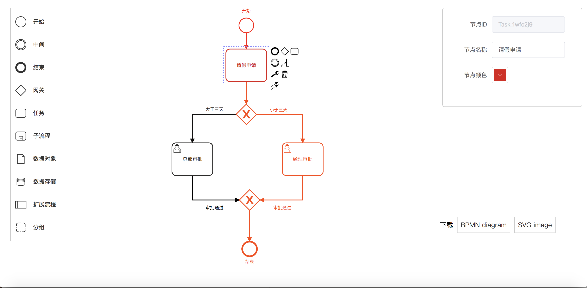

由于公司前段时间在打造一个开发平台，而我主要负责工作流模块，于是就接触到了`bpmn-js`。但众所周知，`bpmn-js` 文档是全英的，相关资料少，填坑的人更少，所以开发起来并没有那么好上手。于是我研究了一段时间，没少踩坑，但收获颇丰，今天就跟大家分享一下。`PS：以前一直做伸手党，今天要扳回一局，先上效果图～`

# 什么是 bpmn-js ?
一个`BPMN 2.0` 渲染工具，简单来说，就是流程设计器。前端利用这样的一个流程设计器，设计流程，导出 `xml`，然后传给后端。启动 activiti 工作流引擎，最后生成流程实例。
官网地址：[https://bpmn.io/toolkit/bpmn-js/](https://bpmn.io/toolkit/bpmn-js/)
Github地址：[https://github.com/bpmn-io](https://github.com/bpmn-io)
# Hello world！
据称，`Hello World` 是世界上第一个演示程序。现在，我们要演示一个最基础的 `bpmn-js` 使用方式。

**1. 在项目内安装 bpmn-js**
```
npm install bpmn-js --save
```
**2. 使用 bpmn-js**
```
<template>
  <div class="containers">
    <div class="canvas" ref="canvas"></div>
  </div>
</template>
```
```
<script>
import BpmnModeler from 'bpmn-js/lib/Modeler' // 引入 bpmn-js
export default {
  data () {
    return {
      bpmnModeler: null
    }
  },
  methods: {
    createNewDiagram () {
      const bpmnXmlStr = `
      <?xml version="1.0" encoding="UTF-8"?>
        <bpmn2:definitions xmlns:bpmn2="http://www.omg.org/spec/BPMN/20100524/MODEL" xmlns:xsi="http://www.w3.org/2001/XMLSchema-instance" xmlns:bpmndi="http://www.omg.org/spec/BPMN/20100524/DI" xmlns:dc="http://www.omg.org/spec/DD/20100524/DC" id="sample-diagram" targetNamespace="http://bpmn.io/schema/bpmn" xsi:schemaLocation="http://www.omg.org/spec/BPMN/20100524/MODEL BPMN20.xsd">
          <bpmn2:process id="process1567044459787" name="流程1567044459787">
            <bpmn2:documentation>描述</bpmn2:documentation>
            <bpmn2:startEvent id="StartEvent_1" name="开始"/>
          </bpmn2:process>
          <bpmndi:BPMNDiagram id="BPMNDiagram_1">
            <bpmndi:BPMNPlane id="BPMNPlane_1" bpmnElement="process1567044459787">
              <bpmndi:BPMNShape id="_BPMNShape_StartEvent_2" bpmnElement="StartEvent_1">
                <dc:Bounds x="184" y="64" width="36" height="36"/>
                <bpmndi:BPMNLabel>
                  <dc:Bounds x="191" y="40" width="22" height="14"/>
                </bpmndi:BPMNLabel>
              </bpmndi:BPMNShape>
            </bpmndi:BPMNPlane>
          </bpmndi:BPMNDiagram>
        <processType id="test"/></bpmn2:definitions>
      `
      // 将字符串转换成图显示出来
      this.bpmnModeler.importXML(bpmnXmlStr, (err) => {
        if (err) {
          console.error(err)
        }
      })
    }
  mounted () {
    const canvas = this.$refs.canvas
    // 生成实例
    this.bpmnModeler = new BpmnModeler({
      container: canvas
    })
    this.createNewDiagram() // 新增流程定义
  }
}
</script>

```
```
<style lang="scss">
  /*左边工具栏以及编辑节点的样式*/
  @import '~bpmn-js/dist/assets/diagram-js.css';
  @import '~bpmn-js/dist/assets/bpmn-font/css/bpmn.css';
  @import '~bpmn-js/dist/assets/bpmn-font/css/bpmn-codes.css';
  @import '~bpmn-js/dist/assets/bpmn-font/css/bpmn-embedded.css';
  .containers{
    position: absolute;
    background-color: #ffffff;
    width: 100%;
    height: 100%;
    .canvas{
      width: 100%;
      height: 100%;
    }
    .bjs-powered-by {
      display: none;
    }
  }
</style>
```
**那么到了这一步，我们就可以得到如下的效果图：**


**是不是觉得和前面的效果图差距很大，哈哈别急。重头戏才刚来，我们接着往下走。**

**3. bpmn-js 属性面板**
我们知道，流程设计不单单只是画图，还需要有节点属性的配置。在此，`bpmn-js`官方有推荐使用 `bpmn-js-properties-panel`工具对流程属性进行修改，效果图长这样：

一目了然，功能很全面，但就是用不起来！几个原因：
**1. UI太丑**
**2. 全是英文，即时汉化了也不尽人意**
**3. 功能不好扩展。例如我们公司有一套自己的组织体系，我要怎样在这个属性面板上使用我们的人员选择控件**
综合以上几点，我果断放弃了使用`bpmn-js-properties-panel`。当然，有需要的同学也可以出门左转，附上Github地址：[https://github.com/bpmn-io/bpmn-js-examples](https://github.com/bpmn-io/bpmn-js-examples)

**下面，我们来编写自己的属性面板，以最简单的Demo来讲最核心的原理！**
首先，bpmn-js 提供了两个有用的 监听方法，藏匿在官网的一些 examples 当中
```
// 监听节点选择变化
this.modeler.on('selection.changed', (e) => {
    const element = e.newSelection[0]
    console.log(element) 
})
```
```
//  监听节点属性变化
this.modeler.on('element.changed', (e) => {
    const { element } = e
    console.log(element) 
})
```
这两个方法，决定了我们可以在自己开发的面板上展示流程节点的相应信息。相信这个不难理解吧～我们只需要开发一个简单的表单就可以验证
```
<div class="property-panel" ref="propertyPanel">
    <el-form :inline="true" :model="form" label-width="100px">
      <el-form-item label="节点ID">
        <el-input v-model="form.id" disabled></el-input>
      </el-form-item>
      <el-form-item label="节点名称">
        <el-input v-model="form.name"></el-input>
      </el-form-item>
    </el-form>
  </div>
```
如上所示，在节点切换的时候，只要对`form`进行赋值，属性面板就会更新了。
**那么我们要怎样修改节点属性，并更新回流程图呢？**
`bpmn-js`同样也提供了相应的方法。
**1.节点名称的更新，2.自定义节点属性的存储**
```
// 节点名称的更新
const modeling = this.modeler.get('modeling')
modeling.updateLabel(this.element, name)
```
```
// 自定义节点属性的存储
const modeling = this.modeler.get('modeling')
modeling.setColor(this.element, {
   fill: null,
   stroke: color
})
modeling.updateProperties(this.element, {color: color})
```
通过上述两个方法就可以处理一些简单的**属性存储以及更新**了。看到这，我相信大家都理解得差不多了。当然，自己开发属性面板，还会涉及到**自定义标签的插入**、**人员配置**、**会签属性以及条件表达式等**
有兴趣的同学可以持续关注，我会继续写下去。毕竟，公司的工作流模块已经完整上线了，我还有好多可以分享的～噢对了，我还把左侧工具栏的样式以及部分功能给改了,同样有着像素眼的同学可以照搬哈哈


# vue-bpmn

## Project setup
```
npm install
```

### Compiles and hot-reloads for development
```
npm run serve
```

### Compiles and minifies for production
```
npm run build
```

### Lints and fixes files
```
npm run lint
```

### Customize configuration
See [Configuration Reference](https://cli.vuejs.org/config/).
